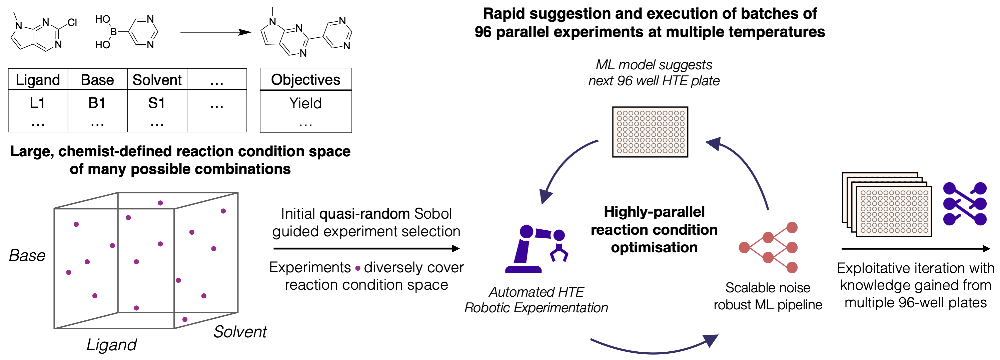

# Minerva
> Machine Intelligence for Efficient Large-Scale Reaction Optimisation with Automation 

```minerva``` is a repository containing code for the application of scalable, multi-objective, batched reaction optimisation described in the manuscript associated with this work. From a user-defined space of reaction conditions, ```minerva``` initialises the optimisation campaign with quasi-random Sobol sampling, and performs large-scale batch optimisation of chemical reactions. ```minerva``` has been deployed experimentally with search spaces of ~100,000 with batch sizes of 96 in High-Throughput Experimentation.



## Installation

```
git clone https://github.com/schwallergroup/minerva.git
cd minerva
conda create --name minerva python=3.8
conda activate minerva
pip install -r requirements.txt
pip install -e .
```

Installation will require several minutes. This method was tested and developed on CUDA-enabled GPUs (linux OS) with CUDA = 11.7 using the install below. 

```conda install pytorch==2.0.1 torchvision==0.15.2 torchaudio==2.0.2 pytorch-cuda=11.7 -c pytorch -c nvidia```

## Tutorials and usage

In the `notebooks` directory, there are 5 Jupyter notebook tutorials. These tutorials detail how to run benchmarks on virtual datasets, create a reaction condition space, initialise and run iterations of optimisation with collected experimental data. 

In the `scripts` directory, we include execution scripts used to run optimisation rounds and obtain optimiser suggestions on the experimental ML HTE campaign described in the manuscript. All computations in the manuscript were run on a workstation with an AMD Ryzen 9 5900X 12-Core CPU and a RTX 3090 (24GB) GPU.

## Data

All HTE experimental data (1632 reactions) collected from experiments described in the manuscript are available in the `experimental_campaigns/experiments/publication/SURF_files` directory in the Simple User-Friendly Reaction Format (SURF).


